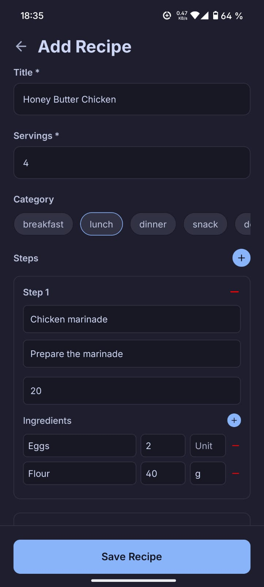
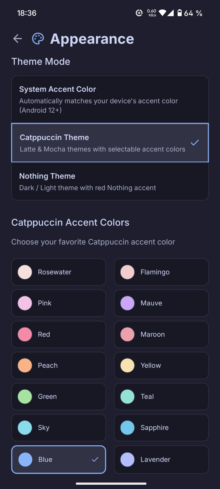
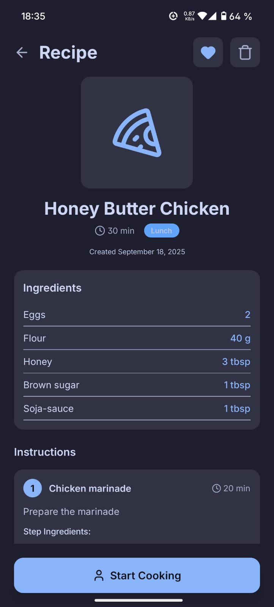
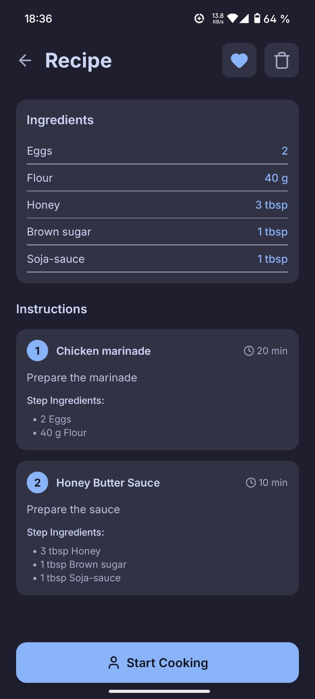

# n-recipe

A customizable offline recipe book with Catppuccin, Nothing and (beta-) System theme.  
This is an [Expo](https://expo.dev) project created with [`create-expo-app`](https://www.npmjs.com/package/create-expo-app).

**Features:**

- Add recipes with steps and ingredients
- View saved Recipes
- Automatically calculate how much of your ingredients you need for more or less persons
- Several themes

Many features to come :)

**Preview:**

<table>
  <tr>
    <td></td>
    <td></td>
  </tr>
  <tr>
    <td></td>
    <td></td>
  </tr>
</table>

# Future Plans

If I suprisingly get the time to work on this enough, and it gains some traction,
I might create a paid pro version of the app with some extra features / improved animations or sth similar,
but it's important for me that in this case the open-source variant stays useable and active.

Another thing I might do, if I find the time, I might add online options, so syncing (-> usage on multiple devices) and public recipes that
can be browsed and rated (although this would be a bigger change, as we would need accounts, a database and maybe a server for that).

If you have any ideas for features, that you want to see, feel free to open an issue.

What I have planned:

- **Ingredients screen:** filter by ingredients you have at home
- **Start cooking** add timer option for steps, select for how many persons
- **All recipes screen filter** filter by types etc

# Contributions

Contributions are welcome, just create a fork, try to use [conventional commits](https://www.conventionalcommits.org/)
(for the branch naming too, e.g. "feat/add-some-feature"), and create a PR in the end.

## Get started

1. Install dependencies

   ```bash
   pnpm install
   ```

2. Start the app

   ```bash
   pnpm expo start
   ```

In the output, you'll find options to open the app in a

- [development build](https://docs.expo.dev/develop/development-builds/introduction/)
- [Android emulator](https://docs.expo.dev/workflow/android-studio-emulator/)
- [Expo Go](https://expo.dev/go), a limited sandbox for trying out app development with Expo

You can start developing by editing the files inside the **app** directory. This project uses [file-based routing](https://docs.expo.dev/router/introduction).

## Learn more

To learn more about developing your project with Expo, look at the following resources:

- [Expo documentation](https://docs.expo.dev/): Learn fundamentals, or go into advanced topics with our [guides](https://docs.expo.dev/guides).
- [Learn Expo tutorial](https://docs.expo.dev/tutorial/introduction/): Follow a step-by-step tutorial where you'll create a project that runs on Android, iOS, and the web.

<br />

<p align="center">
 <a href="https://github.com/a3chron/n-recipe/blob/main/LICENSE"></a>
</p>
